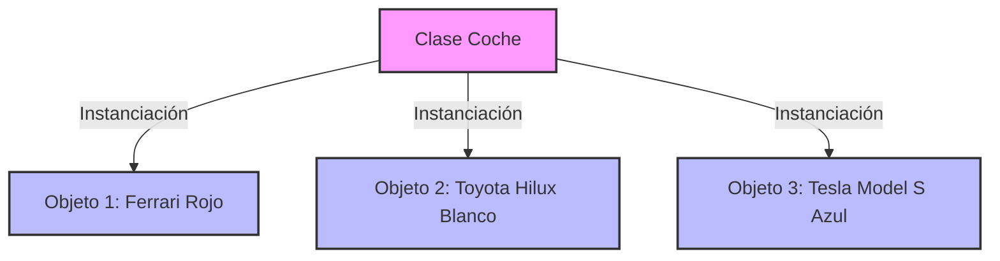

# Fundamentos de la Programación Orientada a Objetos en Java


```video
---
src: "https://vimeo.com/1161284547?share=copy&fl=sv&fe=ci"
title: "Fundamentos de la Programación Orientada a Objetos"
---
```

Bienvenidos a una de las semanas más cruciales de su formación como desarrolladores. Esta semana cambiaremos nuestra forma de pensar: dejaremos de ver el código como una lista de instrucciones secuenciales y empezaremos a verlo como un sistema de **objetos que interactúan entre sí**.

## 1. ¿Qué es POO? (Paradigma Orientado a Objetos)

La Programación Orientada a Objetos (POO) es un modelo de programación que organiza el diseño de software alrededor de datos (objetos), en lugar de funciones y lógica.

### Comparativa: Estructurada vs. Orientada a Objetos

Entender la diferencia es clave para saber por qué la industria prefiere POO para sistemas grandes.

```comparison-table
---
headers:
  - "Criterio"
  - { text: "Programación Estructurada", highlight: false }
  - { text: "POO (Orientada a Objetos)", highlight: true }
rows:
  - ["Unidad Principal", "Función / Procedimiento", "Clase / Objeto"]
  - ["Enfoque", "Acciones (Verbos)", "Entidades (Sustantivos)"]
  - ["Manejo de Datos", "Globales o pasados por parámetros", "Encapsulados dentro de objetos"]
  - ["Reutilización", "Difícil (Copy-Paste)", "Alta (Herencia y Polimorfismo)"]
  - ["Mantenimiento", "Complejo en sistemas grandes", "Más sencillo y modular"]
---
```

### Ejemplo en Código: De lo Estructurado a Objetos

Veamos cómo se traduce esta teoría a código Java real.

```tabs
---[tab title="Enfoque Estructurado" lang="java"]---
public class TiendaEstructurada {
    public static void main(String[] args) {
        // Datos desvinculados
        String producto = "Laptop";
        double precio = 1000.0;
        int stock = 5;

        // Lógica separada de los datos
        stock = vender(stock);
        System.out.println("Vendido: " + producto + ". Quedan: " + stock);
    }

    // Funciones estáticas que reciben datos
    static int vender(int cantidadActual) {
        return cantidadActual - 1;
    }
}

---[tab title="Enfoque Orientado a Objetos" lang="java"]---
public class Producto {
    // Datos y Comportamiento encapsulados juntos
    private String nombre;
    private double precio;
    private int stock;

    public Producto(String nombre, double precio, int stock) {
        this.nombre = nombre;
        this.precio = precio;
        this.stock = stock;
    }

    public void vender() {
        this.stock--;
        System.out.println("Vendido: " + this.nombre + ". Quedan: " + this.stock);
    }
}

// Uso en main:
// Producto lap = new Producto("Laptop", 1000.0, 5);
// lap.vender();
```

## 2. Definiciones Core: Clase vs. Objeto

Estos dos conceptos son el el "Yin y el Yang" de Java. No puede existir uno sin el otro (conceptual o prácticamente).

```cards
---
columns: 2
items:
  - title: "La Clase (El Plano)"
    icon: "DocumentDuplicateIcon"
    content: |
      Es una **plantilla** o molde. Describe qué características (atributos) y qué comportamientos (métodos) tendrán los objetos creados a partir de ella. 
      *Ejemplo: El plano arquitectónico de una casa.*
  - title: "El Objeto (La Realidad)"
    icon: "CubeIcon"
    content: |
      Es una **instancia** de la clase. Es la entidad viva en la memoria del computador que tiene valores específicos para sus atributos.
      *Ejemplo: La casa construida en la Calle 10 #20-30.*
---
```

### Visualizando la Instanciación



## 3. Análisis Anatómico de una Clase (Ejemplo Maestro)

Para que el profesor explique paso a paso: Vamos a diseccionar una clase `Celular` para entender cada órgano vital de su estructura.

```tabs
---[tab title="Celular.java (La Clase)" lang="java"]---
package com.cesde.ejemplo;

// 1. Definición de la Clase (PascalCase)
public class Celular {
    
    // 2. Atributos (Estado)
    // Variables que guardan los datos del objeto
    private String marca;
    private String modelo;
    private int bateria; // Porcentaje 0-100

    // 3. Constructor (Inicialización)
    // Método especial que se ejecuta AL CREAR el objeto
    public Celular(String marca, String modelo) {
        this.marca = marca;
        this.modelo = modelo;
        this.bateria = 100; // Todos los celulares nuevos vienen con carga
    }

    // 4. Métodos (Comportamiento)
    // Acciones que el objeto puede realizar
    public void llamar(String numero) {
        if (this.bateria > 0) {
            System.out.println(this.marca + " llamando a " + numero + "...");
            this.bateria -= 5; // Llamar consume batería
        } else {
            System.out.println("¡Batería agotada!");
        }
    }

    public void cargar() {
        this.bateria = 100;
        System.out.println("El " + this.modelo + " está cargado al 100%.");
    }
}

---[tab title="Main.java (El Uso)" lang="java"]---
package com.cesde.ejemplo;

public class Main {
    public static void main(String[] args) {
        // A. INSTANCIACIÓN
        // 1. Declaración (Celular miCel)
        // 2. Creación (new Celular(...))
        Celular miCel = new Celular("Samsung", "S24");
        Celular otroCel = new Celular("iPhone", "15 Pro");

        // B. USO DE MÉTODOS
        // El operador punto (.) es la "llave" para acceder al objeto
        miCel.llamar("311 123 4567");
        // Salida: Samsung llamando a 311 123 4567...
        
        otroCel.llamar("300 987 6543");
        // Salida: iPhone llamando a 300 987 6543...

        miCel.cargar();
        // Salida: El S24 está cargado al 100%.
    }
}
```

### Explicación Detallada para la Clase

```steps
### 1. El Paquete (`package`)
Es como una carpeta real. Sirve para organizar nuestras clases y evitar conflictos de nombres.
`package com.cesde.ejemplo;`

### 2. La Clase (`class`)
Es el contenedor principal. Define el "tipo" de objeto.
- **public**: Significa que otras clases pueden verla y usarla.
- **PascalCase**: Las clases siempre inician con Mayúscula (ej. `Celular`, `UsuarioSistema`).

### 3. Los Atributos (`private ...`)
Son las variables que viven DENTRO de cada objeto.
- Usamos `private` por el principio de **Encapsulamiento** (nadie debería modificar la batería manualmente, solo a través de métodos).
- `this.marca` se refiere a "la marca DE ESTE objeto específico".

### 4. El Constructor
Es el método que tiene **el mismo nombre de la clase** y no retorna nada (ni siquiera void).
`- Se invoca automáticamente cuando usamos la palabra `new`.
`- Su misión es dejar el objeto listo para usarse (inicializar atributos).

### 5. La Instanciación (`new`)
`Celular miCel = new Celular("X", "Y");`
- **Variable de Referencia (`miCel`)**: Es el "control remoto" que usamos para manejar el objeto.
- **Palabra `new`**: Es la orden a l JVM para que reserve memoria RAM para un nuevo objeto.
```

## 3. Arquitectura de Java: ¿Cómo funciona por dentro?

A menudo escuchamos términos como JDK, JRE y JVM. Vamos a desmitificarlos.

```feature-list
---
items:
  - title: "JVM (Java Virtual Machine)"
    icon: "CogIcon"
    content: |
      Es el motor que **ejecuta** el código. Es quien traduce el bytecode de Java a instrucciones nativas que tu CPU (Intel, AMD, Apple Silicon) entiende. ¡Gracias a la JVM, Java es multiplataforma!
  - title: "JRE (Java Runtime Environment)"
    icon: "ServerIcon"
    content: |
      Es el conjunto de herramientas + la JVM. Incluye las librerías base de Java (`java.lang`, `java.util`, etc.) necesarias para *correr* programas, pero no para crear nuevos.
  - title: "JDK (Java Development Kit)"
    icon: "CodeBracketIcon"
    content: |
      Es el kit completo para **desarrolladores**. Incluye el JRE + herramientas de compilación (`javac`), depuración y documentación. **Es lo que nosotros instalamos.**
---
```

### Estructura de un Proyecto Java Típico

Cuando comiences a trabajar, verás una estructura de carpetas similar a esta:

```file-tree
---
highlight:
  - "src"
  - "pom.xml"
annotations:
  "src": "Código fuente"
  "pom.xml": "Gestor de dependencias (Maven)"
  "target": "Archivos compilados (.class)"
---
mi-proyecto-java/
├── .git/
├── .idea/
├── src/
│   ├── main/
│   │   ├── java/
│   │   │   └── com/
│   │   │       └── empresa/
│   │   │           └── App.java
│   │   └── resources/
│   └── test/
├── target/
├── pom.xml
└── README.md
```

## 4. Instalación del Entorno (Hands-on)

Vamos a preparar tu máquina de guerra.

```steps
### 1. Descarga el JDK
Para este curso usaremos **Eclipse Temurin JDK 17 (LTS)**. Es estable, gratuito y de código abierto.
[Descargar desde Adoptium.net](https://adoptium.net/)

### 2. Instalación
Ejecuta el instalador. **¡OJO!**: Asegúrate de que la opción "Set JAVA_HOME variable" o "Add to PATH" esté seleccionada en el asistente de instalación. Esto es vital para que la terminal reconozca el comando `java`.

### 3. Verificación
Abre una nueva terminal (PowerShell o CMD) y escribe:
`java -version`
`javac -version`

Si ves números de versión (ej: 17.0.x), ¡estás listo!
```

## 5. Tu Primer Código: Hello World

Analicemos la anatomía del programa más famoso del mundo.

```tabs
---[tab title="HolaMundo.java" lang="java"]---
public class HolaMundo {
    // El método main es el punto de entrada de la aplicación
    public static void main(String[] args) {
        System.out.println("¡Hola Mundo! Bienvenidos a POO.");
    }
}

---[tab title="Compilación (Terminal)" lang="bash"]---
# 1. Compilar (Crear el bytecode .class)
javac HolaMundo.java

# 2. Ejecutar (Invocar a la JVM)
java HolaMundo
```

### Desglosando el código

```accordion
---
allowMultiple: true
---
### public class HolaMundo
Define una clase pública. En Java, el nombre del archivo **debe coincidir exactamente** con el nombre de la clase pública (`HolaMundo.java`).

### public static void main(String[] args)
Es el método sagrado. La JVM busca *exactamente* esta firma para comenzar a ejecutar el programa.
- **public**: Accesible desde cualquier lugar.
- **static**: Pertenece a la clase, no requiere instanciar un objeto para ejecutarse.
- **void**: No retorna ningún valor.
- **String[] args**: Permite recibir argumentos desde la terminal.

### System.out.println
Es la forma de imprimir texto en la consola estándar.
```

```admonition
---
type: tip
title: "Reto de la Semana"
---
Intenta modificar el "Hola Mundo" para que imprima también tu nombre y tu edad en líneas separadas. ¡Experimenta rompiendo el código (quita un punto y coma `;`) y observa qué errores te da el compilador `javac`!
```
### Crear proyeto de Java

```video
---
src: "https://vimeo.com/1166500414?share=copy&fl=sv&fe=ci"
title: "Crear proyeto de Java"
---
```