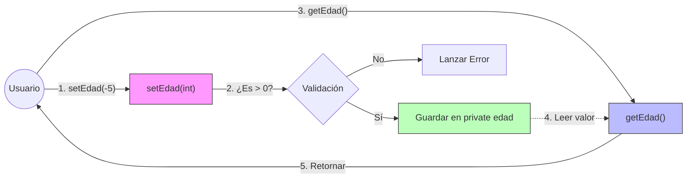
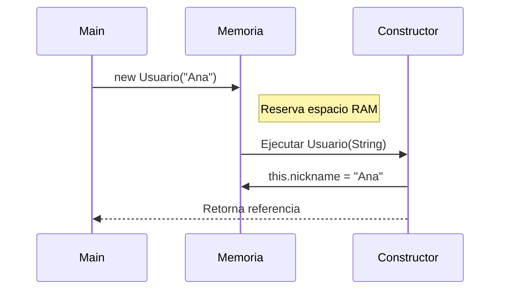

+++hero-section
---
title: "Atributos, Constructores y Encapsulamiento"
subtitle: "Domina el arte de proteger tus datos: Aprende por qué los atributos privados y los métodos de acceso son la regla de oro en Java."
backgroundImage: "https://images.unsplash.com/photo-1639322537228-ad7117a76743?q=80&w=2070"
overlayOpacity: 0.7
buttons:
  - text: "Ver Tutorial"
    url: "#metodos-de-acceso-getters-y-setters"
    variant: "primary"
    icon: "LockClosedIcon"
  - text: "Documentación Oficial"
    url: "https://docs.oracle.com/javase/tutorial/java/javaOO/accesscontrol.html"
    variant: "secondary"
---
+++

Bienvenidos a la tercera semana. Ya sabemos qué es una clase y un objeto. Ahora vamos a profundizar en sus órganos vitales: **atributos**, **constructores** y, lo más importante, cómo proteger esa información mediante el **encapsulamiento** y los métodos de acceso.

## Ciclo de Vida de un Dato

Antes de entrar en código, entendamos qué pasa con un dato desde que se piensa hasta que se usa.

+++timeline
### 1. Declaración | La Definición
Definimos que existirá una variable de cierto tipo. Aún no tiene valor real.
`private int edad;`

---

### 2. Inicialización | El Nacimiento
Le asignamos su primer valor, usualmente en el **Constructor**.
`this.edad = 18;`

---

### 3. Protección | El Escudo
Al ser `private`, nadie fuera de la clase puede tocar este dato directamente.
`obj.edad = -5; // Error de compilación`

---

### 4. Acceso Controlado | La Puerta
Usamos métodos públicos para leer (Get) o modificar (Set) el valor bajo nuestras reglas.
`obj.setEdad(20);`
+++

## 1. Atributos: Primitivos vs Wrappers

En Java, no todo es un objeto. Por razones de rendimiento, existen los tipos "primitivos". Sin embargo, para trabajar con herramientas modernas (como Bases de Datos o JSON), necesitamos sus versiones en "objeto" (Wrappers).

```comparison-table
---
headers:
  - "Característica"
  - { text: "Tipos Primitivos", highlight: false }
  - { text: "Clases Envolventes (Wrappers)", highlight: true }
rows:
  - ["Naturaleza", "Dato simple (valor puro)", "Objeto (instancia de clase)"]
  - ["Memoria", "Muy eficiente (Stack)", "Ocupa más espacio (Heap)"]
  - ["Valor nulo", "No pueden ser null", "Sí pueden ser null"]
  - ["Métodos", "No tienen métodos", "Tienen métodos útiles (.parseInt(), .toString())"]
  - ["Uso principal", "Cálculos matemáticos, bucles", "Colecciones (Listas), bases de datos"]
---
```

### Los 8 Tipos Primitivos

```cards
---
columns: 4
items:
  - title: "Enteros"
    icon: "CubeIcon"
    content: |
      **byte, short, int, long**
      Desde 8 hasta 64 bits. El `int` es el estándar.
  - title: "Decimales"
    icon: "ChartPieIcon"
    content: |
      **float, double**
      Para números con coma. `double` es el más preciso.
  - title: "Caracteres"
    icon: "IdentificationIcon"
    content: |
      **char**
      Un solo símbolo Unicode. Se usa con comillas simples 'A'.
  - title: "Lógicos"
    icon: "CheckCircleIcon"
    content: |
      **boolean**
      Verdadero o Falso. Indispensable para decisiones.
---
```

## 2. Métodos de Acceso (Getters y Setters)

```video
---
src: "https://vimeo.com/1163509797?share=copy&fl=sv&fe=ci"
title: "Métodos de Acceso (Getters y Setters)"
---
```

Aquí entramos en el corazón del **Encapsulamiento**. Los Getters y Setters no son simples caprichos de Java; son los guardianes de la integridad de tu software.

### ¿Qué son realmente?

Son métodos públicos simples cuyo único trabajo es **interconectar** el mundo exterior con los datos privados de tu objeto.

*   **Getter (Accesor)**: "Dame el valor". Permite LEER un dato privado.
*   **Setter (Mutador)**: "Cambia el valor". Permite ESCRIBIR un dato privado (bajo ciertas condiciones).

### Anatomía Detallada

Vamos a diseccionar la sintaxis estándar que usa el 99% de la industria Java.

#### 1. Estructura de un GETTER

```java
//     (1)    (2)          (3)
    public String getNombre() {
        return this.nombre; // (4)
    }
```
1.  **Visibilidad Pública**: Debe ser accesible desde fuera.
2.  **Tipo de Retorno**: DEBE coincidir con el tipo del atributo que devuelve.
3.  **Convención de Nombre**: `get` + Nombre del atributo (con la primera en mayúscula). CamelCase.
4.  **Retorno**: Devuelve el valor del atributo interno.

#### 2. Estructura de un SETTER

```java
//     (1)  (2)      (3)           (4)
    public void setNombre(String nombre) {
        this.nombre = nombre; // (5)
    }
```
1.  **Visibilidad Pública**: Accesible desde fuera.
2.  **Void**: Generalmente no devuelve nada (su trabajo es hacer, no decir).
3.  **Convención de Nombre**: `set` + Nombre del atributo.
4.  **Parámetro**: Recibe el nuevo valor que queremos asignar.
5.  **Asignación**: Actualiza el atributo interno con el valor recibido.

### Casos de Uso Avanzados

No siempre es un simple "entra y sale". Aquí es donde brilla el encapsulamiento.

```tabs
---[tab title="1. Validación (La muralla)" lang="java"]---
public class CuentaBancaria {
    private double saldo;

    // Getter simple
    public double getSaldo() {
        return saldo;
    }

    // Setter CON VALIDACIÓN
    // Aquí protegemos la integridad del dato.
    public void setSaldo(double saldo) {
        if (saldo >= 0) {
            this.saldo = saldo;
        } else {
            System.out.println("❌ Error: El saldo no puede ser negativo.");
            // Opcional: lanzar una excepción
            // throw new IllegalArgumentException("Saldo negativo no permitido");
        }
    }
}
---[tab title="2. Propiedad de Solo Lectura" lang="java"]---
public class Usuario {
    private String dni; // El DNI no debería cambiar nunca

    public Usuario(String dni) {
        this.dni = dni;
    }

    // Solo proveemos Getter.
    // Al NO existir un Setter, hacemos que el atributo sea INMUTABLE
    // desde fuera de la clase una vez creado.
    public String getDni() {
        return this.dni;
    }
}
---[tab title="3. Propiedad Calculada (Virtual)" lang="java"]---
public class Rectangulo {
    private double ancho;
    private double alto;

    // ... constructores y setters para ancho/alto ...

    // Este Getter NO devuelve un atributo directo.
    // CALCULA un valor en tiempo real. 
    // Para quien lo usa, parece un atributo más: rect.getArea()
    public double getArea() {
        return this.ancho * this.alto;
    }
}
---[tab title="4. El Caso Booleano (is)" lang="java"]---
public class Tarea {
    private boolean completada; // true o false

    // Convención Especial:
    // Para booleanos, en lugar de 'get', usamos 'is'.
    // Suena más natural: "if (tarea.isCompletada())"
    public boolean isCompletada() {
        return completada;
    }

    public void setCompletada(boolean completada) {
        this.completada = completada;
    }
}
```

### Diagrama de Flujo de Datos



## 3. Constructores: El Origen

```video
---
src: "https://vimeo.com/1163506306?share=copy&fl=sv&fe=ci"
title: "Constructores"
---
```

El constructor es el método especial que se ejecuta **automáticamente** al crear una instancia (`new`). Su misión es inicializar el objeto.

### Visualizando la Invocación



### Tipos de Constructores

```accordion
---
allowMultiple: true
---
### Constructor Por Defecto (Implícito)
Si no escribes NINGÚN constructor, Java crea uno vacío e invisible por ti. Desaparece apenas escribes uno propio.

### Constructor Vacío (No-args)
Es aquel que definimos explícitamente sin parámetros. Útil para crear objetos "vacíos" y llenarlos luego con `setters`.

### Constructor Parametrizado
Recibe argumentos para obligar a que el objeto nazca con datos. Es la forma más segura de crear objetos consistentes.
```

### Sobrecarga de Constructores (Overloading)

Podemos tener múltiples formas de crear un mismo objeto.

```tabs
---[tab title="Usuario.java" lang="java"]---
public class Usuario {
    private String nombre;
    private int nivel;

    // Opción 1: Crear usuario básico
    public Usuario() {
        this.nombre = "Invitado";
        this.nivel = 1;
    }

    // Opción 2: Crear con nombre
    public Usuario(String nombre) {
        this.nombre = nombre;
        this.nivel = 1;
    }

    // Opción 3: Crear usuario avanzado
    public Usuario(String nombre, int nivel) {
        this.nombre = nombre;
        this.nivel = nivel;
    }
}
```

+++quiz
---
questions:
  - text: "¿Qué método se usa para leer a un atributo booleano?"
    choices:
      - getActivo()
      - isActivo()
      - readActivo()
      - booleanActivo()
    answer: "isActivo()"
  - text: "Si quiero que un atributo sea de solo lectura, ¿qué debo hacer?"
    choices:
      - Ponerlo public
      - Crear solo el Getter y no el Setter
      - Crear solo el Setter
      - Usar la palabra clave 'readonly'
    answer: "Crear solo el Getter y no el Setter"
  - text: "¿Dónde es el mejor lugar para validar que un dato sea correcto?"
    choices:
      - En el método main
      - En el Getter
      - En el Setter
      - En la base de datos
    answer: "En el Setter"
---
+++

## 4. Conversión de Datos (Extra)

### Casteo y Parseo

A menudo los datos no llegan en el formato que necesitamos. Aquí es donde entran estas dos técnicas.

```tabs
---[tab title="Casteo (Casting)" lang="java"]---
// EL CASTEO es forzar un tipo de dato a comportarse como otro compatible.

public class EjemploCasteo {
    public static void main(String[] args) {
        
        // 1. Casteo Implícito (Automático)
        // De pequeño a grande, no hay riesgo de pérdida.
        int entero = 100;
        double decimal = entero; // 100.0
        
        // 2. Casteo Explícito (Manual)
        // De grande a pequeño, ¡PELIGRO de pérdida de datos!
        double precio = 99.99;
        int precioEntero = (int) precio; // Se trunca a 99
        
        System.out.println("Precio casteado: " + precioEntero); // 99
    }
}

---[tab title="Parseo (Parsing)" lang="java"]---
// EL PARSEO es convertir Texto (String) a Número.
// Es vital al leer inputs de usuario o archivos.

public class EjemploParseo {
    public static void main(String[] args) {
        String edadTexto = "25";
        
        // Usamos los métodos estáticos de las Clases Wrapper
        int edad = Integer.parseInt(edadTexto);
        double precio = Double.parseDouble("1500.50");
        
        // Ahora sí podemos operar
        System.out.println("Edad futura: " + (edad + 5)); // 30
    }
}
```

```admonition
---
type: tip
title: "Reto Semanal"
---
Crea una clase `Termostato` con un atributo privado `temperatura`. 
1. El Getter debe devolver la temperatura en grados Celsius.
2. Crea un método extra `getTemperaturaFahrenheit()` que devuelva el cálculo convertido (Propiedad Calculada).
3. El Setter debe impedir que la temperatura sea menor a -273°C (Cero Absoluto).
```
