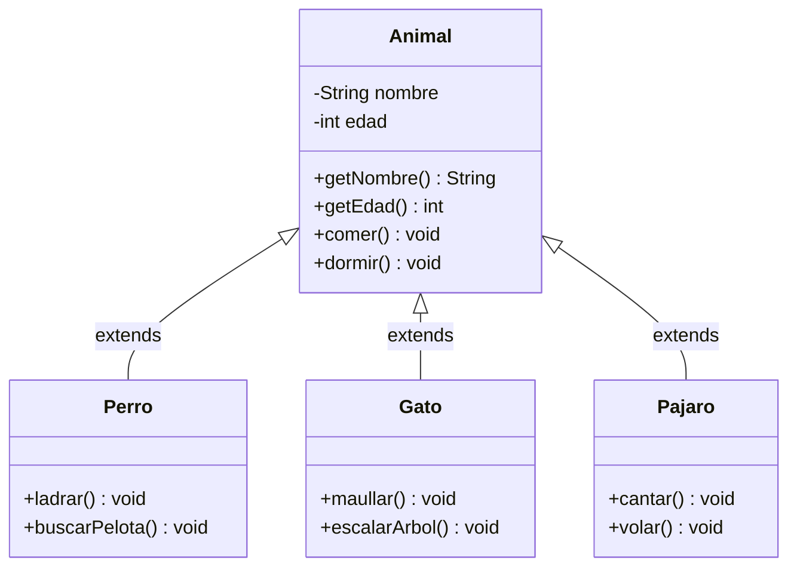
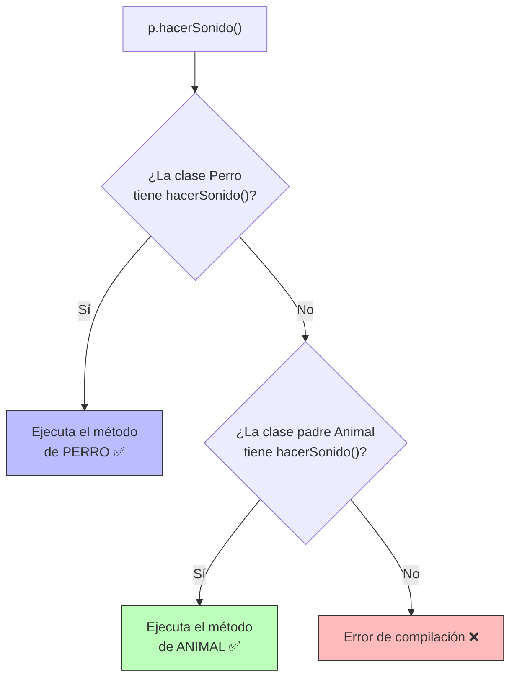
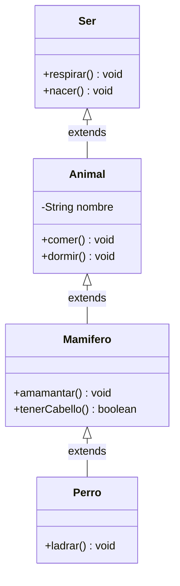
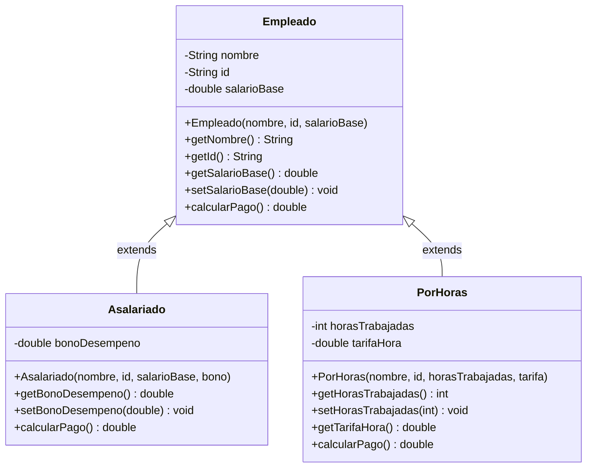

+++hero-section
---
title: "Herencia en Java"
subtitle: "Aprende a construir familias de clases inteligentes: reutiliza código, evita la repetición y crea jerarquías poderosas como lo hacen los profesionales."
backgroundImage: "https://images.unsplash.com/photo-1558494949-ef010cbdcc31?q=80&w=2070"
overlayOpacity: 0.72
buttons:
  - text: "Comenzar"
    url: "#1-que-es-la-herencia"
    variant: "primary"
    icon: "AcademicCapIcon"
  - text: "Documentación Oficial"
    url: "https://docs.oracle.com/javase/tutorial/java/IandI/subclasses.html"
    variant: "secondary"
---
+++

La herencia es uno de los **cuatro pilares de la Programación Orientada a Objetos (POO)**. Cuando la dominas, pasas de escribir código repetitivo a construir software elegante, reutilizable y fácil de mantener. 🚀

## ¿Por qué importa esto?

+++stat-cards
---
columns: 4
items:
  - icon: "DocumentDuplicateIcon"
    value: "0%"
    label: "Código duplicado con buena herencia"
    color: "green"
  - icon: "CubeIcon"
    value: "1"
    label: "Clase padre para múltiples hijos"
    color: "blue"
  - icon: "LightningBoltIcon"
    value: "3x"
    label: "Más rápido al agregar nuevas clases"
    color: "purple"
  - icon: "ShieldCheckIcon"
    value: "100%"
    label: "Reutilización del código del padre"
    color: "teal"
---
+++

---

## 1. ¿Qué es la Herencia?

Imagina que tienes que describir los siguientes animales: un **Perro**, un **Gato** y un **Pájaro**.

Todos ellos comparten cosas en común: tienen un nombre, una edad, y todos comen. Pero cada uno también tiene algo propio: el perro ladra, el gato maúlla, el pájaro vuela.

**La herencia nos permite poner lo común en una clase "padre" (o superclase) y que las clases "hijas" (o subclases) hereden esas características automáticamente.**

Es como la vida real: heredas los ojos de tu mamá y la altura de tu papá, pero tú eres una persona única.

+++admonition
---
type: note
title: "Definición Formal"
---
La **herencia** es el mecanismo por el cual una clase (subclase o clase hija) adquiere automáticamente los atributos y métodos de otra clase (superclase o clase padre). Se usa la palabra clave `extends`.
+++

---

## 2. El Problema Sin Herencia

Mira qué pasa cuando **NO usamos** herencia. Este es el error que cometen los principiantes:

+++tabs
---[tab title="❌ Sin Herencia (MAL)" lang="java"]---
// Tenemos código REPETIDO en cada clase. Imagina tener 50 tipos de animales...

public class Perro {
    private String nombre; // REPETIDO
    private int edad;      // REPETIDO

    public void comer() {  // REPETIDO
        System.out.println(nombre + " está comiendo.");
    }

    public void ladrar() {
        System.out.println("¡Guau!");
    }
}

public class Gato {
    private String nombre; // REPETIDO
    private int edad;      // REPETIDO

    public void comer() {  // REPETIDO
        System.out.println(nombre + " está comiendo.");
    }

    public void maullar() {
        System.out.println("¡Miau!");
    }
}

// Problema: si quieres cambiar "comer()", debes editar CADA clase.
// Esto viola el principio DRY: "Don't Repeat Yourself"

---[tab title="✅ Con Herencia (BIEN)" lang="java"]---
// Lo común va en la clase PADRE (Animal).
// Cada clase hija solo agrega lo que es único de ella.

public class Animal {           // CLASE PADRE (Superclase)
    private String nombre;
    private int edad;

    public void comer() {
        System.out.println(nombre + " está comiendo.");
    }
}

public class Perro extends Animal {  // CLASE HIJA (Subclase)
    public void ladrar() {
        System.out.println("¡Guau!");
    }
    // Perro YA TIENE nombre, edad y comer() heredados de Animal
}

public class Gato extends Animal {   // CLASE HIJA (Subclase)
    public void maullar() {
        System.out.println("¡Miau!");
    }
    // Gato YA TIENE nombre, edad y comer() heredados de Animal
}
+++

---

## 3. La Palabra Clave `extends`

La sintaxis es muy simple. Para que una clase herede de otra, usamos `extends`:

```java
public class ClaseHija extends ClasePadre {
    // Aquí solo defines lo que es NUEVO o DIFERENTE
}
```

+++admonition
---
type: tip
title: "Regla de Oro"
---
En Java, una clase solo puede **extender UNA** clase padre (herencia simple). Pero puede implementar **múltiples interfaces** (lo veremos más adelante). ¡No te preocupes, es más sencillo de lo que suena!
+++

---

## 4. Diagrama de Herencia (El Árbol Familiar)

Así se ve la estructura de herencia. La clase padre está arriba y las hijas están abajo conectadas con flechas:



Lo que ves en el diagrama de arriba:
- `Animal` es la **superclase** (clase padre). Tiene lo común a todos.
- `Perro`, `Gato` y `Pajaro` son **subclases** (clases hijas). Heredan todo de `Animal` y agregan lo suyo.
- Las flechas van de hijo hacia padre, diciendo: "Yo soy un tipo de Animal".

---

## 5. Código Completo Paso a Paso

Vamos a construir el ejemplo completo de la familia `Animal`:

+++tabs
---[tab title="1. Animal.java (Padre)" lang="java"]---
// Esta es la clase BASE o PADRE.
// Aquí ponemos todo lo que es COMÚN a todos los animales.
public class Animal {

    // Atributos privados (encapsulamiento)
    private String nombre;
    private int edad;

    // Constructor: para dar nombre y edad al nacer
    public Animal(String nombre, int edad) {
        this.nombre = nombre;
        this.edad = edad;
    }

    // Getters y Setters (acceso controlado)
    public String getNombre() {
        return nombre;
    }

    public int getEdad() {
        return edad;
    }

    // Método común a TODOS los animales
    public void comer() {
        System.out.println(nombre + " está comiendo. 🍖");
    }

    public void dormir() {
        System.out.println(nombre + " está durmiendo. 💤");
    }
}

---[tab title="2. Perro.java (Hijo)" lang="java"]---
// Perro HEREDA de Animal usando 'extends'
// Automáticamente tiene: nombre, edad, comer(), dormir()
public class Perro extends Animal {

    // Atributo PROPIO del Perro (no existe en Animal)
    private String raza;

    // El constructor de Perro debe llamar al constructor de Animal
    // usando 'super(...)' - lo vemos en detalle en la sección 6
    public Perro(String nombre, int edad, String raza) {
        super(nombre, edad); // Llama al constructor de Animal
        this.raza = raza;
    }

    public String getRaza() {
        return raza;
    }

    // Método PROPIO del Perro
    public void ladrar() {
        System.out.println(getNombre() + " dice: ¡Guau! 🐕");
    }

    public void buscarPelota() {
        System.out.println(getNombre() + " fue a buscar la pelota. 🎾");
    }
}

---[tab title="3. Gato.java (Hijo)" lang="java"]---
// Gato también HEREDA de Animal
public class Gato extends Animal {

    // Atributo PROPIO del Gato
    private boolean esIndoor; // ¿Vive adentro de la casa?

    public Gato(String nombre, int edad, boolean esIndoor) {
        super(nombre, edad); // Llama al constructor de Animal
        this.esIndoor = esIndoor;
    }

    public boolean isEsIndoor() {
        return esIndoor;
    }

    // Método PROPIO del Gato
    public void maullar() {
        System.out.println(getNombre() + " dice: ¡Miau! 🐈");
    }

    public void escalarArbol() {
        System.out.println(getNombre() + " subió al árbol. 🌳");
    }
}

---[tab title="4. Main.java (Prueba)" lang="java"]---
public class Main {
    public static void main(String[] args) {

        // Creamos un Perro
        Perro miPerro = new Perro("Rex", 3, "Labrador");

        // Usamos métodos HEREDADOS de Animal
        miPerro.comer();   // Animal.comer()
        miPerro.dormir();  // Animal.dormir()

        // Usamos métodos PROPIOS de Perro
        miPerro.ladrar();
        miPerro.buscarPelota();

        System.out.println("Raza: " + miPerro.getRaza());

        System.out.println("---");

        // Creamos un Gato
        Gato miGato = new Gato("Luna", 5, true);

        // Métodos HEREDADOS de Animal
        miGato.comer();
        miGato.dormir();

        // Métodos PROPIOS del Gato
        miGato.maullar();
        miGato.escalarArbol();
    }
}

/* Salida esperada:
Rex está comiendo. 🍖
Rex está durmiendo. 💤
Rex dice: ¡Guau! 🐕
Rex fue a buscar la pelota. 🎾
Raza: Labrador
---
Luna está comiendo. 🍖
Luna está durmiendo. 💤
Luna dice: ¡Miau! 🐈
Luna subió al árbol. 🌳
*/
+++

---

## 6. La Palabra Clave `super`

Cuando trabajas con herencia, `super` se convierte en tu mejor herramienta. Tiene **dos usos esenciales**:

+++timeline
### Uso 1 | super() — Llamar al Constructor del Padre
Cuando una clase hija tiene su propio constructor, **DEBE** llamar al constructor del padre para que los atributos heredados se inicialicen correctamente. Se hace con `super(...)` y **siempre en la primera línea**.

---

### Uso 2 | super.metodo() — Llamar a un Método del Padre
Si una clase hija **sobreescribió** un método del padre pero también quiere ejecutar el código original del padre, usa `super.metodo()`. Muy útil para "agregar" comportamiento sin reemplazarlo completamente.
+++

```java
public class Perro extends Animal {

    public Perro(String nombre, int edad, String raza) {
        // Uso 1: super() llama al constructor de Animal
        // Debe ser la PRIMERA línea del constructor siempre
        super(nombre, edad);
        this.raza = raza;
    }

    @Override
    public void comer() {
        // Uso 2: super.comer() ejecuta el método original de Animal
        super.comer(); // Imprime: "Rex está comiendo."

        // Luego agrega comportamiento propio del Perro
        System.out.println("(Y mueve la cola felizmente 🐾)");
    }
}
```

+++admonition
---
type: warning
title: "¡Advertencia!"
---
Si olvidas llamar `super(...)` en el constructor y la clase padre no tiene un constructor vacío, Java lanzará un **error de compilación**. ¡Es obligatorio!
+++

---

## 7. Sobreescritura de Métodos (`@Override`)

Este es uno de los conceptos más importantes de la herencia. Una clase hija puede **redefinir** (sobreescribir) un método heredado para que se comporte de forma diferente.

La anotación `@Override` le dice a Java: *"Estoy intencionalmente sobreescribiendo un método del padre"*. Aunque no es obligatoria, es una **buena práctica** que protege tu código de errores tipográficos.

+++tabs
---[tab title="Animal.java" lang="java"]---
public class Animal {
    private String nombre;

    public Animal(String nombre) {
        this.nombre = nombre;
    }

    public String getNombre() {
        return nombre;
    }

    // Este método será sobreescrito por cada hijo
    public void hacerSonido() {
        System.out.println("El animal hace un sonido genérico...");
    }
}

---[tab title="Perro.java" lang="java"]---
public class Perro extends Animal {

    public Perro(String nombre) {
        super(nombre);
    }

    // @Override indica que estamos reemplazando hacerSonido() del padre
    @Override
    public void hacerSonido() {
        System.out.println(getNombre() + " dice: ¡Guau! 🐕");
    }
}

---[tab title="Gato.java" lang="java"]---
public class Gato extends Animal {

    public Gato(String nombre) {
        super(nombre);
    }

    @Override
    public void hacerSonido() {
        System.out.println(getNombre() + " dice: ¡Miau! 🐈");
    }
}

---[tab title="Pajaro.java" lang="java"]---
public class Pajaro extends Animal {

    public Pajaro(String nombre) {
        super(nombre);
    }

    @Override
    public void hacerSonido() {
        System.out.println(getNombre() + " dice: ¡Pío pío! 🐦");
    }
}

---[tab title="Main.java" lang="java"]---
public class Main {
    public static void main(String[] args) {
        Animal a  = new Animal("Animal");
        Perro p   = new Perro("Rex");
        Gato g    = new Gato("Luna");
        Pajaro pj = new Pajaro("Tweety");

        a.hacerSonido();  // El animal hace un sonido genérico...
        p.hacerSonido();  // Rex dice: ¡Guau! 🐕
        g.hacerSonido();  // Luna dice: ¡Miau! 🐈
        pj.hacerSonido(); // Tweety dice: ¡Pío pío! 🐦
    }
}
+++

### ¿Cómo decide Java cuál método ejecutar?



Java siempre busca el método **primero en la clase hija**, y si no lo encuentra, sube a la clase padre. Esto se llama **despacho dinámico** o **polimorfismo**.

---

## 8. La Relación "ES UN" (IS-A)

Hay una regla simple para saber si tiene sentido usar herencia: pregúntate si la frase **"ClaseHija ES UN ClasePadre"** tiene sentido.

+++comparison-table
---
headers:
  - "Relación"
  - { text: "¿Tiene sentido?", highlight: false }
  - { text: "¿Usar herencia?", highlight: true }
rows:
  - ["Perro ES UN Animal", "✅ Sí, lógico", "true"]
  - ["Gato ES UN Animal", "✅ Sí, lógico", "true"]
  - ["Coche ES UN Vehiculo", "✅ Sí, lógico", "true"]
  - ["Rueda ES UN Coche", "❌ No, una rueda no es un coche", "false"]
  - ["Motor ES UN Coche", "❌ El motor es PARTE de un coche", "false"]
  - ["Empleado ES Una Persona", "✅ Sí, tiene sentido", "true"]
---
+++

+++admonition
---
type: note
title: "Herencia vs Composición"
---
Cuando la relación es "TieneUN" (HAS-A), en lugar de herencia debes usar **composición** (un objeto contiene a otro como atributo). Por ejemplo, un `Coche` **TIENE UN** `Motor`, entonces `Motor` sería un atributo dentro de `Coche`, no una clase que extienda de `Coche`.
+++

---

## 9. Modificadores de Acceso y Herencia

No todos los miembros del padre son accesibles para el hijo de la misma manera. Esta tabla te muestra exactamente qué puede ver quién:

+++comparison-table
---
headers:
  - "Modificador"
  - { text: "Misma Clase", highlight: false }
  - { text: "Clase Hija", highlight: true }
  - "Otra Clase"
rows:
  - ["private", "✅ Sí", "❌ No (solo vía getters)", "❌ No"]
  - ["(sin modificador)", "✅ Sí", "✅ Solo mismo paquete", "✅ Solo mismo paquete"]
  - ["protected", "✅ Sí", "✅ Sí (siempre)", "❌ No"]
  - ["public", "✅ Sí", "✅ Sí (siempre)", "✅ Sí"]
---
+++

+++admonition
---
type: tip
title: "Consejo Práctico"
---
En herencia, usa `protected` cuando quieras que solo la clase padre y sus hijos tengan acceso directo a un atributo, sin exponerlo al resto del mundo. Es una alternativa más relajada que `private` pero más segura que `public`.
+++

---

## 10. Cadena de Herencia (Herencia Multinivel)

Una clase hija puede, a su vez, ser padre de otra clase. Esto crea una **cadena de herencia**:



En este caso, `Perro` hereda **todo** de:
- `Mamifero` (amamantar, tenerCabello)
- `Animal` (nombre, comer, dormir)
- `Ser` (respirar, nacer)

Solo con `extends Mamifero`, `Perro` obtiene toda la cadena hacia arriba. 🔗

+++admonition
---
type: warning
title: "No abuses de la cadena"
---
Aunque Java permite cadenas largas de herencia, en la práctica **más de 2-3 niveles** suele ser una señal de que el diseño está equivocado. Mantén las jerarquías simples y claras.
+++

---

## 🏫 Actividad de Clase — Sistema de Empleados

En esta actividad vas a construir una pequeña jerarquía de herencia inspirada en situaciones laborales reales. Tendrás una **clase padre** y dos **subclases** que la extienden con comportamientos distintos.

### Vista General del Diseño

+++comparison-table
---
headers:
  - "Componente"
  - { text: "Empleado (Padre)", highlight: false }
  - { text: "Asalariado (Hijo A)", highlight: true }
  - { text: "PorHoras (Hijo B)", highlight: false }
rows:
  - ["Responsabilidad", "Define la identidad base y reglas de salario mínimo.", "Gestiona empleados de planta con bonos fijos.", "Gestiona contratistas por tiempo trabajado."]
  - ["Atributos (private)", "nombre, id, salarioBase", "bonoDesempeno", "horasTrabajadas, tarifaHora"]
  - ["Validación (Setter)", "No permite salarios < 1000.", "No permite bonos negativos.", "Máximo 160 horas por mes."]
  - ["Método Principal", "calcularPago() → retorna base", "@Override calcularPago() → Base + Bono", "@Override calcularPago() → Horas × Tarifa"]
  - ["Uso de super", "Define el constructor inicial.", "Llama a super() para nombre e ID.", "Llama a super() para datos básicos."]
---
+++

### Diagrama de Clases



### Código de la Actividad

+++tabs
---[tab title="Empleado.java (Padre)" lang="java"]---
public class Empleado {

    private String nombre;
    private String id;
    private double salarioBase;

    // Constructor base
    public Empleado(String nombre, String id, double salarioBase) {
        this.nombre = nombre;
        this.id = id;
        setSalarioBase(salarioBase); // Usamos el setter para validar desde el inicio
    }

    // Getters
    public String getNombre()     { return nombre; }
    public String getId()         { return id; }
    public double getSalarioBase(){ return salarioBase; }

    // Setter CON VALIDACIÓN: el salario mínimo es 1000
    public void setSalarioBase(double salarioBase) {
        if (salarioBase >= 1000) {
            this.salarioBase = salarioBase;
        } else {
            System.out.println("❌ Salario inválido. Debe ser >= 1000. Se asigna 1000.");
            this.salarioBase = 1000;
        }
    }

    // Método base: retorna el salario base directamente
    public double calcularPago() {
        return salarioBase;
    }

    @Override
    public String toString() {
        return "[" + id + "] " + nombre + " — Pago: $" + calcularPago();
    }
}

---[tab title="Asalariado.java (Hijo A)" lang="java"]---
// Asalariado ES UN Empleado de planta con bono de desempeño
public class Asalariado extends Empleado {

    private double bonoDesempeno;

    // Llama a super() para inicializar los datos del padre
    public Asalariado(String nombre, String id, double salarioBase, double bono) {
        super(nombre, id, salarioBase);
        setBonoDesempeno(bono); // Validamos el bono desde el inicio
    }

    public double getBonoDesempeno() { return bonoDesempeno; }

    // Setter CON VALIDACIÓN: el bono no puede ser negativo
    public void setBonoDesempeno(double bono) {
        if (bono >= 0) {
            this.bonoDesempeno = bono;
        } else {
            System.out.println("❌ El bono no puede ser negativo. Se asigna 0.");
            this.bonoDesempeno = 0;
        }
    }

    // Sobreescribimos calcularPago(): Salario Base + Bono
    @Override
    public double calcularPago() {
        return getSalarioBase() + bonoDesempeno;
    }
}

---[tab title="PorHoras.java (Hijo B)" lang="java"]---
// PorHoras ES UN Empleado contratista que cobra según horas trabajadas
public class PorHoras extends Empleado {

    private int horasTrabajadas;
    private double tarifaHora;

    // Llama a super() con un salarioBase de 0 (no aplica el base fijo)
    public PorHoras(String nombre, String id, int horasTrabajadas, double tarifaHora) {
        super(nombre, id, 0); // El salario base no se usa directamente aquí
        setHorasTrabajadas(horasTrabajadas);
        this.tarifaHora = tarifaHora;
    }

    public double getTarifaHora()    { return tarifaHora; }
    public int getHorasTrabajadas()  { return horasTrabajadas; }

    // Setter CON VALIDACIÓN: máximo 160 horas por mes
    public void setHorasTrabajadas(int horas) {
        if (horas >= 0 && horas <= 160) {
            this.horasTrabajadas = horas;
        } else {
            System.out.println("❌ Horas inválidas (0–160). Se asigna el límite.");
            this.horasTrabajadas = horas > 160 ? 160 : 0;
        }
    }

    // Sobreescribimos calcularPago(): Horas × Tarifa por hora
    @Override
    public double calcularPago() {
        return horasTrabajadas * tarifaHora;
    }
}

---[tab title="Main.java (Prueba)" lang="java"]---
public class Main {
    public static void main(String[] args) {

        // Creamos un empleado asalariado
        Asalariado emp1 = new Asalariado("Ana Pérez", "E001", 2500.0, 300.0);

        // Creamos un empleado por horas
        PorHoras emp2 = new PorHoras("Carlos Ruiz", "E002", 120, 15.0);

        // Probamos validaciones
        Asalariado empBonoBad = new Asalariado("Luis", "E003", 900, -50); // Salario y bono inválidos
        PorHoras empHorasBad  = new PorHoras("María", "E004", 200, 12.0); // Horas exceden 160

        System.out.println("=== Resumen de Pagos ===");
        System.out.println(emp1);       // [E001] Ana Pérez — Pago: $2800.0
        System.out.println(emp2);       // [E002] Carlos Ruiz — Pago: $1800.0
        System.out.println(empBonoBad); // [E003] Luis — Pago: $1000.0 (ajustes aplicados)
        System.out.println(empHorasBad);// [E004] María — Pago: $1920.0 (160h máximo)
    }
}

/* Salida esperada:
❌ Salario inválido. Debe ser >= 1000. Se asigna 1000.
❌ El bono no puede ser negativo. Se asigna 0.
❌ Horas inválidas (0–160). Se asigna el límite.
=== Resumen de Pagos ===
[E001] Ana Pérez — Pago: $2800.0
[E002] Carlos Ruiz — Pago: $1800.0
[E003] Luis — Pago: $1000.0
[E004] María — Pago: $1920.0
*/
+++

### Reglas de la Actividad

+++admonition
---
type: note
title: "📋 Instrucciones"
---
1. Crea los tres archivos Java en tu proyecto: `Empleado.java`, `Asalariado.java` y `PorHoras.java`.
2. Crea `Main.java` y prueba los casos que se muestran en la pestaña de arriba.
3. Agrega **al menos un caso de prueba extra** diferente a los del ejemplo.
4. Verifica que las **validaciones funcionen** pasando valores inválidos a los setters.
5. Asegúrate de usar `@Override` en los métodos `calcularPago()` de las subclases.
+++

+++admonition
---
type: tip
title: "💡 Puntos clave a recordar"
---
- La clase `Empleado` no debe instanciarse directamente si la piensas como base, pero en este ejercicio sí puede hacerlo (no es abstracta).
- Cada subclase llama a `super(nombre, id, salarioBase)` para no repetir la inicialización de esos datos.
- Usa `getSalarioBase()` (getter del padre) en las subclases para acceder al atributo privado, nunca directamente.
+++

### Comprueba tu Comprensión

+++quiz
---
questions:
  - text: "En Asalariado, ¿cómo se inicializa el atributo 'nombre' que viene del padre Empleado?"
    choices:
      - "Se asigna directamente: this.nombre = nombre"
      - "Con super(nombre, id, salarioBase) en el constructor"
      - "Con un setter de Empleado llamado desde Asalariado"
      - "Java lo inicializa automáticamente"
    answer: "Con super(nombre, id, salarioBase) en el constructor"
  - text: "¿Qué retorna calcularPago() en la clase Asalariado?"
    choices:
      - "Solo el bono de desempeño"
      - "Solo el salario base"
      - "Horas × TarifaHora"
      - "SalarioBase + BonoDesempeno"
    answer: "SalarioBase + BonoDesempeno"
  - text: "Si creamos: PorHoras p = new PorHoras('X','001',200,10.0); ¿Cuántas horas quedan registradas?"
    choices:
      - "200"
      - "160"
      - "0"
      - "Error de compilación"
    answer: "160"
  - text: "¿Por qué usamos @Override en calcularPago() dentro de Asalariado?"
    choices:
      - "Para crear un método nuevo que no existía"
      - "Para indicar que reemplazamos la versión del padre Empleado"
      - "Para que el método sea privado"
      - "Es obligatorio en todos los métodos de una subclase"
    answer: "Para indicar que reemplazamos la versión del padre Empleado"
---
+++
