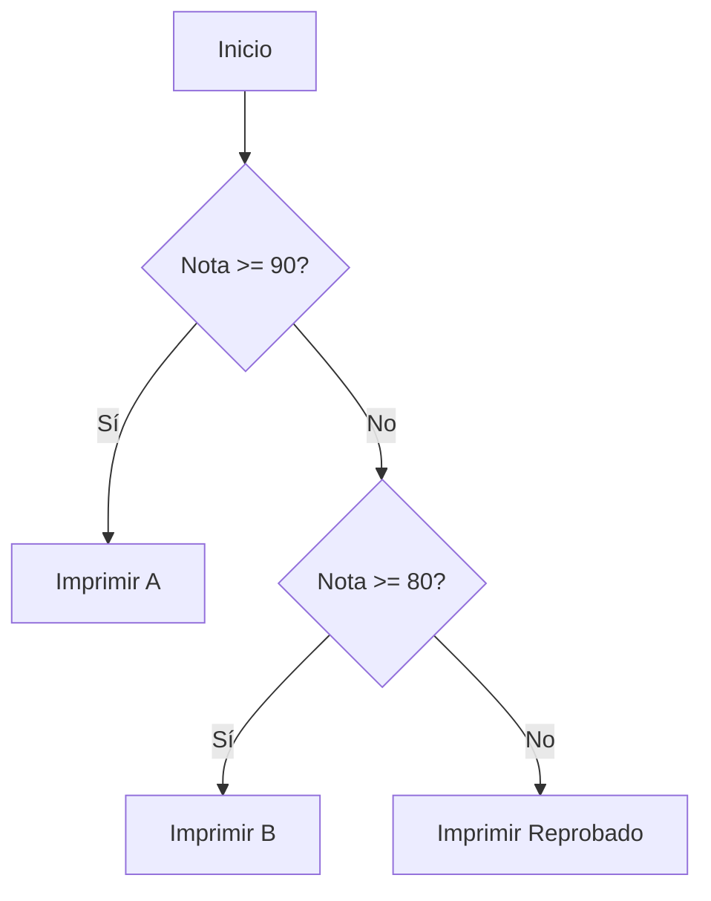

Permiten que el programa tome decisiones y ejecute diferentes bloques de código según condiciones.

## IF - ELSE
La estructura básica para decisiones binarias o múltiples condiciones secuenciales.




## SWITCH
Optimizado para evaluar una variable contra múltiples casos fijos. Ideal para menús.

## Operador Ternario
Una forma concisa de escribir un `if-else` en una sola línea:
`condición ? valor_si_true : valor_si_false`

```tabs
---[tab title="Topic07_ControlFlujo.java" lang="java"]---
package com.cesde;

public class Topic07_ControlFlujo {

    public static void explicar() {
        System.out.println("--- TEMA 7: CONTROL DE FLUJO ---");

        int nota = 85;

        // 1. IF - ELSE IF - ELSE
        if (nota >= 90) {
            System.out.println("Calificación: A");
        } else if (nota >= 80) {
            System.out.println("Calificación: B");
        } else {
            System.out.println("Reprobado");
        }

        // 2. SWITCH
        // Útil para menús o casos discretos
        int diaSemana = 3;
        String nombreDia;

        switch (diaSemana) {
            case 1: nombreDia = "Lunes"; break;
            case 2: nombreDia = "Martes"; break;
            case 3: nombreDia = "Miércoles"; break;
            // ...
            default: nombreDia = "Otro"; break;
        }
        System.out.println("Hoy es: " + nombreDia);

        // 3. Ternario
        String estado = (nota >= 60) ? "Aprovado" : "Reprobado";
        System.out.println("Estado final: " + estado);

        System.out.println("--------------------------------\n");
    }
}
```
