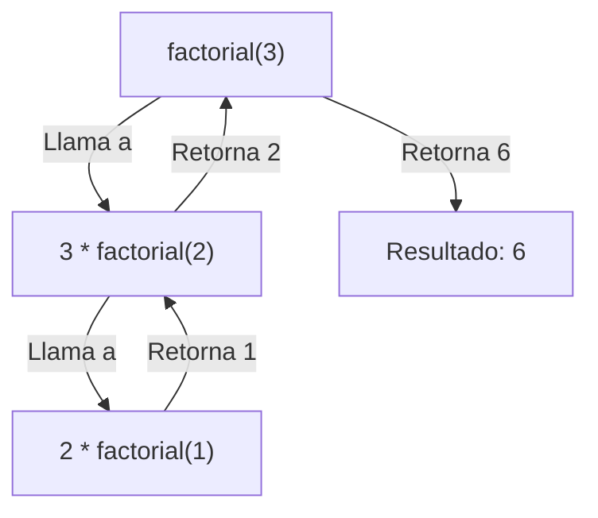

Un método recursivo es aquel que **se llama a sí mismo**. Es una técnica poderosa pero requiere cuidado para evitar bucles infinitos.

## Reglas de Oro
1.  **Caso Base**: Una condición de salida que detiene la recursión (`if (n <= 1) return 1;`).
2.  **Llamada Recursiva**: El método se llama a sí mismo con un subproblema más pequeño (`n * factorial(n - 1)`).

### Visualización de Factorial(3)




```tabs
---[tab title="Topic14_Recursividad.java" lang="java"]---
package com.cesde;

public class Topic14_Recursividad {

    public static void explicar() {
        System.out.println("--- TEMA 14: RECURSIVIDAD ---");

        // 1. Factorial
        int num = 5;
        System.out.println("Factorial de " + num + ": " + factorial(num));

        // 2. Cuenta Regresiva
        System.out.println("Cuenta regresiva:");
        cuentaRegresiva(5);
    }

    public static long factorial(int n) {
        // Caso Base: Factorial de 1 es 1
        if (n <= 1) return 1;
        
        // Llamada Recursiva
        return n * factorial(n - 1);
    }

    public static void cuentaRegresiva(int n) {
        if (n < 0) return; // Caso base
        
        System.out.print(n + " ");
        cuentaRegresiva(n - 1);
    }
}
```
